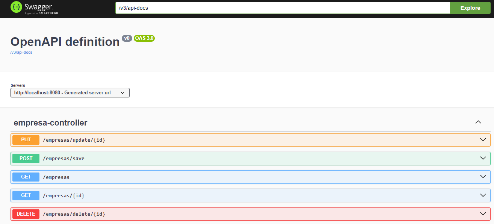

# API REST de Empresas

Este repositório contém uma API REST desenvolvida com Spring Boot versão 3.3.2, implementando um CRUD completo para gerenciamento de empresas. 
A aplicação segue uma arquitetura em camadas, com as camadas Controller, Service, Repository e Entidades.

## Tecnologias Utilizadas

- **Spring Boot 3.3.3**: Framework principal para construção da API.
- **JPA & Hibernate**: Para mapeamento objeto-relacional e persistência de dados.
- **MySQL**: Banco de dados utilizado para armazenar as informações das empresas.
- **Bean Validation**: Para validação dos dados da entidade Empresa.
- **Postman**: Utilizado para testar e validar os endpoints da API.
- **Swagger**: Para documentação interativa dos endpoints da API.

## Estrutura do Projeto

O projeto segue uma arquitetura tradicional em camadas:

- **Controller**: Responsável por receber as requisições HTTP e retornar as respostas.
- **Service**: Contém a lógica de negócios da aplicação.
- **Repository**: Camada de acesso a dados, utilizando Spring Data JPA.
- **Entidades**: Representam os objetos de domínio, mapeados para as tabelas do banco de dados.

## Endpoints Disponíveis 

### Empresas

- **GET /empresas**: Retorna todos as empresas.
  - **Resposta**: `200 OK`
  ```json
  [
    {
      "id": 20,
      "nome": "Empresa Teste1",
      "cnpj": "14275282000144",
      "email": "empretateste1@gmail.com"
    },
    {
      "id": 21,
      "nome": "Empresa Teste2",
      "cnpj": "14275282000225",
      "email": "empretateste2@gmail.com"
    }
  ]

## Documentação Swagger
A API está documentada utilizando Swagger, permitindo que você explore os endpoints e teste as requisições diretamente do navegador.

- URL de acesso: http://localhost:8080/api  
<br>

## Banco de Dados MySQL
A aplicação utiliza o banco de dados MySQL para persistência de dados. Certifique-se de que o MySQL está configurado e em execução. Abaixo estão as informações necessárias para configurar a aplicação:

## Configurações de Conexão
- **URL de Conexão**: jdbc:mysql://${MYSQL_HOST:localhost}:3306/<nome_do_banco>
- **Usuário do Banco de Dados**: root
- **Senha do Banco de Dados**: (deixe em branco ou insira sua senha)

## Como Executar
1. Clone o repositório:  
   ```bash
   https://github.com/ecalazaes/CRUD-Empresas.git
   
2. Navegue até o diretório do projeto:  
   ```bash
   cd CRUD-Empresas
  
3. Execute o projeto:  
   ```bash
   ./mvnw spring-boot:run

4. Configuração no application.properties  
  - No arquivo src/main/resources/application.properties, insira ou atualize as seguintes propriedades:  
    ```bash
    # Acesso ao banco de dados
    spring.datasource.url=jdbc:mysql://${MYSQL_HOST:localhost}:3306/<nome_do_banco>
    
    # Usuário do banco de dados
    spring.datasource.username=root
    
    # Senha do banco de dados
    spring.datasource.password=
    ```

5. Acesse a API no endereço:
   ```bash
   http://localhost:8080/Empresas 

## Licença

Este projeto está licenciado sob a [MIT License](LICENSE).
